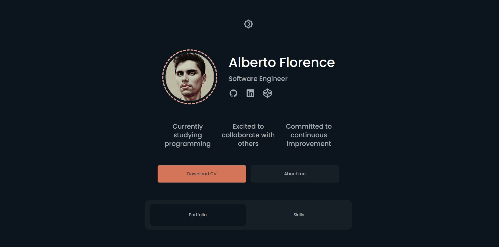

# Portfolio



## Descrição

Bem-vindo ao meu [Portfolio](https://albertoflorence.com.br)! Este é um site pessoal onde você pode conhecer mais sobre mim, explorar meus projetos, habilidades e ver vídeos de demonstração dos meus trabalhos. Além disso, você também pode acessar o código-fonte dos projetos diretamente no GitHub.

## Tecnologias Utilizadas

O projeto foi desenvolvido utilizando as seguintes tecnologias:

- Next.js
- Tailwind CSS
- TypeScript

## Como Executar o Projeto

Para visualizar o meu Portfolio em sua máquina local, siga os passos abaixo:

1. Faça o clone deste repositório em um diretório de sua preferência utilizando o seguinte comando:

```
git clone git@github.com:albertoflorence/alberto-florence.git
```

2. Navegue até o diretório do projeto:

```
cd alberto-florence
```

3. Instale as dependências necessárias executando o seguinte comando:

```
npm install
```

4. Com todas as dependências instaladas, agora você pode iniciar o servidor de desenvolvimento usando o seguinte comando:

```
npm run dev
```

O site estará acessível em [http://localhost:3000](http://localhost:3000).

## Navegação

No meu Portfolio, você encontrará as seguintes seções:

- **About Me:** Saiba mais sobre minha experiência, educação e interesses.
- **Portfolio:** Explore os projetos que desenvolvi, com informações detalhadas, vídeos de demonstração e links para o GitHub.
- **Skills:** Descubra as habilidades técnicas e conhecimentos que possuo.

## Estrutura do Projeto

Aqui está uma breve visão geral da estrutura de pastas do projeto:

```
portfolio/
  ├── app/
  │   ├── layout.tsx
  │   ├── page.tsx
  │   ├── globals.css.tsx
  ├── components/
  │   ├── AboutMe.tsx
  │   ├── Portfolio.tsx
  │   ├── Skills.tsx
  │   └── ...
  ├── public/
  │   ├── images/
  │   │   ├── project1.jpg
  │   │   ├── project2.jpg
  │   │   └── ...
  │   └── ...
  ├── tsconfig.json
  ├── tailwind.config.js
  ├── package.json
  └── README.md
```

- A pasta `app` contém os arquivos que representa a página do Portfolio.
- `components` contém os componentes React utilizados no projeto.
- `public` contém arquivos estáticos, como imagens e outros recursos.
- `tsconfig.json` é o arquivo de configuração do TypeScript.
- `tailwind.config.json` é o arquivo de configuração do Tailwind.

Sinta-se à vontade para explorar e modificar o código conforme suas necessidades.
